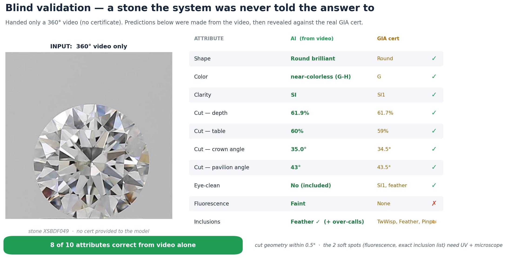
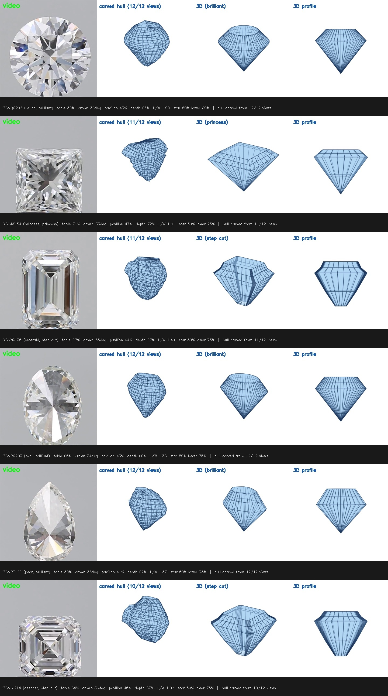

# Diamond grading from 360° video

**A computer-vision research prototype that turns rotating diamond videos into an auditable grading dossier.** It combines multi-view classifiers, proportion estimation, inclusion localization, and certificate comparison. The central question is practical: which grading signals can ordinary video recover, and which require a better capture rig?

*One illustrative stone, compared with its certificate after prediction. The aggregate held-out results below are the performance measure.*

## Measured performance

Models were retrained after a fixed 1,500-stone holdout was set aside. The reported grading results were measured on 1,200 of those unseen, certificate-labeled stones, with no training overlap. Accuracy reflects the inventory's natural class distribution and uses prior correction at inference.

| Task | Held-out result | Interpretation |
| --- | ---: | --- |
| Shape · 10 classes | **99.3% accuracy** | Strong visual signal |
| Color · 3 classes | **87.2% accuracy** | Strong, but sensitive to capture conditions |
| Eye-clean · 2 classes | **89.4% accuracy** | Useful screening signal |
| Clarity · 3 classes | **70.3% accuracy** | Needs higher-resolution capture |
| Inclusions · multi-label | **0.55 precision / 0.84 recall** | Screening and localization, not final grading |
| Geometry · depth / table / L:W | **0.54 pp / 0.86 pp / 0.01 MAE** | Scale-free proportions |

With a **separately weighed carat value**, estimated physical dimensions had mean absolute errors of **0.091 mm depth, 0.138 mm width, and 0.279 mm length** on a separate 400-stone holdout. Video alone cannot supply absolute scale. Fluorescence reached only **45.2% accuracy**, below its **58% majority-class baseline**: a white-light video does not provide the UV signal it needs.

The [full results and evaluation notes](RESULTS.md) give baselines, model variants, and the correction of an earlier data-leakage error. The figures above are the subsequent locked-test measurements.

## How it works

~~~mermaid
flowchart LR
    A[Certificate-labeled inventory] --> B[Stone-level train / validation / test split]
    V[360° videos] --> F[Sampled frames]
    B --> M[Multi-view grading models]
    F --> M
    F --> G[Silhouette and geometry estimates]
    M --> D[Digital dossier]
    G --> D
    W[Measured carat weight] --> X[Physical dimension estimate]
    G --> X
    X --> D
    A --> Q[Certificate comparison]
    D --> Q
~~~

The pipeline ingests certificate records, downloads authorized media, extracts frames, builds stone-level splits, trains task-specific heads, and produces a per-stone report with predictions, geometry, inclusion heatmaps, and certificate QC. The models use multiple views of each stone; the geometry path estimates proportions from imagery and adds measured weight only when physical dimensions are needed.

*Examples across six cuts: video frames, multi-view hulls, and parametric 3D illustrations. These are visualizations, not validated exact 3D reconstructions from video.*

## Explore the repository

| Start here | Purpose |
| --- | --- |
| [RESULTS.md](RESULTS.md) | Locked-test benchmarks, baselines, failure modes, and experimental history |
| [OVERVIEW.md](OVERVIEW.md) | Project thesis and capture-station concept |
| [CAPTURE_RIG.md](CAPTURE_RIG.md) | Hardware path for UV, microscopy, controlled pose, and scale |
| [Ingest](src/01_ingest_excel.py) → [manifest](src/04_build_manifest.py) | Data ingestion, media extraction, and stone-level splits |
| [Grading heads](src/train_shape_model.py), [inclusions](src/train_inclusion.py), [geometry](src/train_geometry.py) | Model training |
| [Grade evaluation](src/evaluate_grade.py), [dimensions](src/mm_dimensions.py) | Evaluation and physical-dimension estimates |
| [Digital dossier](src/digital_cert.py), [QC report](src/qc_report.py) | Per-stone dossier and certificate QC |

The project also includes [a packetizer](src/packetizer.py) that packages frames and metadata for an S3-compatible ingestion pipeline. It uploads frames before the metadata commit marker, so consumers do not see incomplete stones.

## Run it with your own authorized data

Use Python 3.12, create a virtual environment, and install [requirements.txt](requirements.txt). PyTorch and torchvision can be installed from the appropriate [official wheel index](https://pytorch.org/get-started/locally/) for your machine.

~~~bash
python3.12 -m venv .venv
source .venv/bin/activate
pip install -r requirements.txt
cp config/.env.example config/.env
# Set AARIN_MEDIA_TOKEN in config/.env only if your authorized media requires it.
python src/01_ingest_excel.py
python src/02_download_media.py --kind videos --dry-run
~~~

The training dataset, source videos, certificates, and model checkpoints are **not included** in this public repository. The ingestion and evaluation commands require access to your own authorized data; the published benchmarks cannot be reproduced from this checkout alone. Keep tokens in the local environment file or an environment variable, never in tracked files.

## What the experiments changed

An initial alphabetical sampling strategy inadvertently selected correlated vendor and capture batches. A later evaluation also had overlap with newly expanded training sets. Both inflated early results. The project switched to randomized balanced sampling, fixed the holdout before retraining, verified zero overlap, and reported the corrected scores above. This is the most important lesson in the repository: evaluation design mattered as much as model architecture.

The remaining gaps point to specific hardware: UV lighting for fluorescence, microscope and darkfield views for inclusions and clarity, a measured weight for carat, and a calibrated turntable for exact profile geometry. See the [capture-rig plan](CAPTURE_RIG.md).
